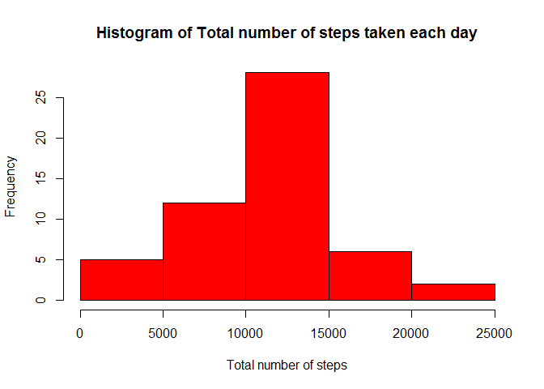
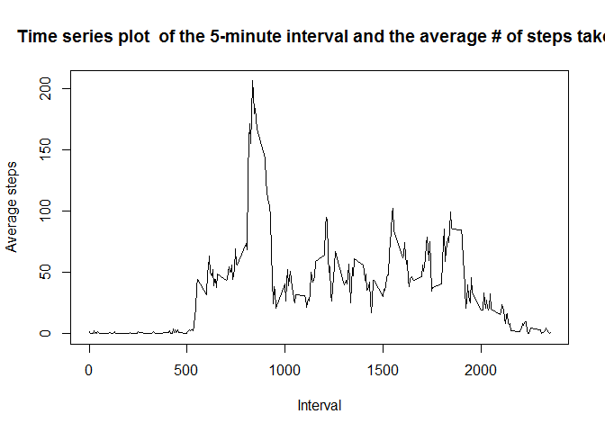
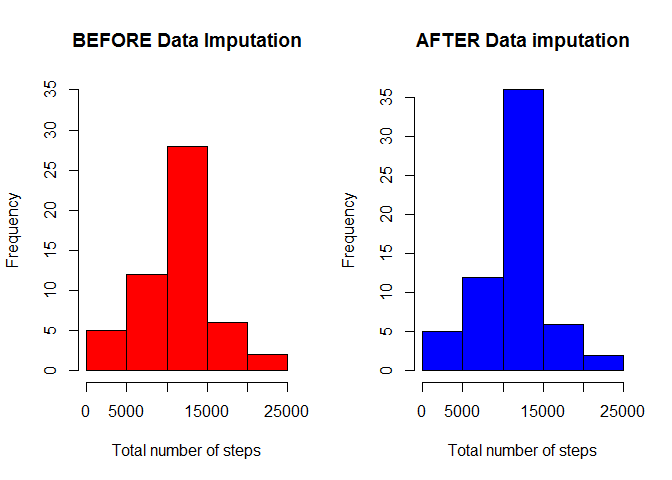
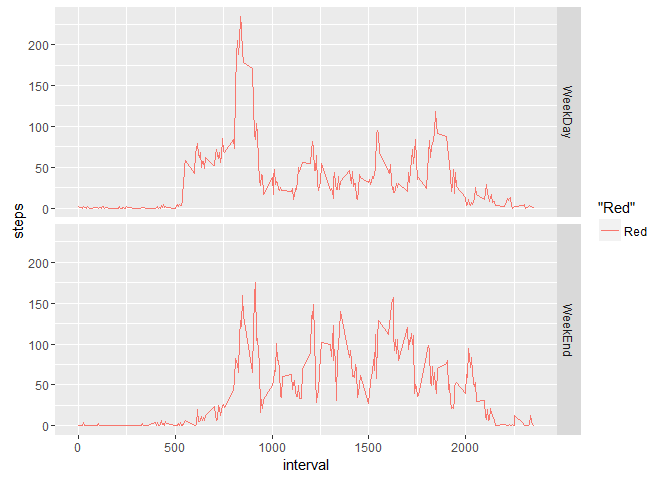

# Reproducible Research: Peer Assessment 1
##[1] Read the data.
#### 1. setwd() to location where "activity.csv" is present.
#### 2. Assumption: Packages plyr and ggplot2 are pre-installed. 

```r
        # Read the file
        Activity <- read.csv("activity.csv",header = TRUE)
```

##[2] Draw the histogram

```r
        # Calculate the sum using aggregration function
        Agg_Activity <- aggregate(steps ~ date, Activity, sum)
        hist(   Agg_Activity$steps
                ,main = "Histogram of Total number of steps taken each day"
                ,xlab = "Total number of steps"
                ,col = "red"
        )
```

<!-- -->

##[3] Mean and median number of steps taken each day

```r
        mean_total_Activity <- mean(Agg_Activity$steps)
        med_total_Activity  <- median(Agg_Activity$steps)
```
###[3.1] Mean of Total steps per day

```r
        # Mean
        mean_total_Activity
```

```
## [1] 10766.19
```
###[3.2] Median of Total steps per day

```r
        # Median
        med_total_Activity
```

```
## [1] 10765
```
##[4.1] Time series plot of the average number of steps taken

```r
        # Get the mean using mean and Aggregrate function
        int_agg <- aggregate(steps~ interval, Activity, mean, na.rm=TRUE)
        plot(x = int_agg$interval, y = int_agg$steps, type = "l", xlab = "Interval", ylab = "Average steps", main = "Time series plot  of the 5-minute interval and the average # of steps taken")
```

<!-- -->

##[4.2] Which 5-minute interval, on average across all the days in the dataset, contains the maximum number of steps?

```r
        # Get the interval that has the MAX steps
        subset(int_agg, steps== max(int_agg$steps))
```

```
##     interval    steps
## 104      835 206.1698
```

##[5] Impute Data
###[5.1] Calculate and report the total number of missing values in the dataset (i.e. the total number of rows with NAs)

```r
        # Find the total number of NA in STEPS column
        sum(is.na(Activity$steps))
```

```
## [1] 2304
```

###[5.2]Devise a strategy for filling in all of the missing values in the dataset.

```r
        # Using Mean on a given date to impute doesn't really help. Use Mean() for a given interval             works. 
        library(plyr)
        
        # create a function Impute.mean that is called from ddply function.
        impute.mean <- function(x) replace(x, is.na(x), mean(x, na.rm = TRUE))

        # Call ddply function         
        New_Dataset <- ddply(Activity, ~ interval, transform, steps = impute.mean(steps))
     
        New_Dataset<- New_Dataset[order(New_Dataset$date, New_Dataset$interval), ]
        
        # Check to test for NAs
        sum(is.na(New_Dataset$steps)) # The sum should be = 0
```

```
## [1] 0
```

###[5.3]Make a histogram of the total number of steps taken each day and Calculate and report the mean and median total number of steps taken per day.


```r
        # Get the new sum after data imputation 
        New_Agg_Activity <- aggregate(steps ~ date, New_Dataset, sum)
        par(mfrow = c(1, 2))
        # Draw a histogram to compare the results.
        hist(   Agg_Activity$steps
                ,main = "BEFORE Data Imputation"
                ,xlab = "Total number of steps"
                ,col = "red"
                ,ylim = c(0,35)
        )
        hist(   New_Agg_Activity$steps
                ,main = "AFTER Data imputation"
                ,xlab = "Total number of steps"
                ,col = "blue"
        )
```

<!-- -->

```r
        New_mean_Activity <- mean(New_Agg_Activity$steps)
        New_med_Activity  <- median(New_Agg_Activity$steps)
```

####[5.3.1] New Mean steps by Day

```r
        # Mean
        New_mean_Activity
```

```
## [1] 10766.19
```

####[5.3.2] New Median Steps by Day

```r
        # Median
        New_med_Activity
```

```
## [1] 10766.19
```
####[5.3.4]Do these values differ from the estimates from the first part of the assignment? 
### YES on a minor scale.

```r
        # a Matrix to show the Mean and Median before and after Data imputation.
        Comp <- matrix(nrow = 2, ncol = 2)
        colnames(Comp) <-c("Mean" , "Median")
        rownames(Comp) <-c("Before Data Imputation", "After Data Imputation")
        Comp[1,1] <- mean_total_Activity
        Comp[1,2] <- med_total_Activity
        Comp[2,1] <- New_mean_Activity
        Comp[2,2] <- New_med_Activity
        Comp
```

```
##                            Mean   Median
## Before Data Imputation 10766.19 10765.00
## After Data Imputation  10766.19 10766.19
```

####[5.3.5] What is the impact of imputing missing data on the estimates of the total daily number of steps?
        The median changes from 10765.00 to 10766.19
        
##[6] Are there differences in activity patterns between weekdays and weekends?
#### Yes. There are differences in actitivy patterns. During week days most of the acitivity is concentrated around interval 835 with 206 + steps. During weekend no one concentration peaks. Activities are spread across intervals 800 - 2000. 

```r
        # Using Mutate to create the new Factor Column DayType = {Weekday, Weekend}
        Activity <- mutate(Activity, DayType = ifelse(weekdays(as.Date(Activity$date)) %in% c("Saturday" , "Sunday"),yes = "Weekend",no = "WeekDay"))
        
        # Get the MEan of all Week Days
        Wkday_interval_agg <- aggregate(steps~ interval, subset(Activity, DayType == "WeekDay"),mean , na.rm=TRUE)
        # Create new Data frame for plotting
        New_Interval_Agg <- Wkday_interval_agg
        New_Interval_Agg$DayType <- "WeekDay"
        
        # Get the Mean of all Week Ends
        Wkend_interval_agg <- aggregate(steps~ interval, subset(Activity, DayType == "Weekend"),mean , na.rm=TRUE)
        # Add a factor variable Weekend
        Wkend_interval_agg$DayType <- "WeekEnd"
        New_Interval_Agg <- rbind(New_Interval_Agg, Wkend_interval_agg)
        
        # Plot using Qplot. Lpad ggplot2
        library(ggplot2)
        qplot(y=steps, x=interval, data = New_Interval_Agg, facets = DayType ~.,geom = "line"
            ,  col="Red")
```

<!-- -->
